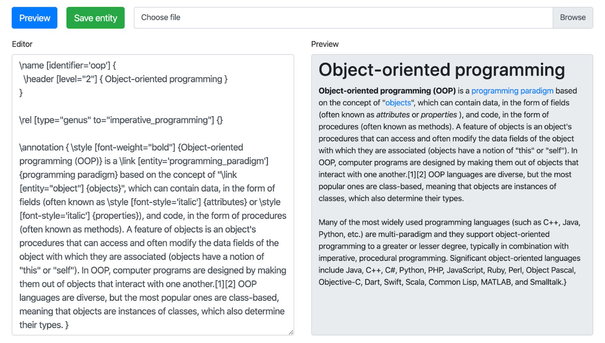
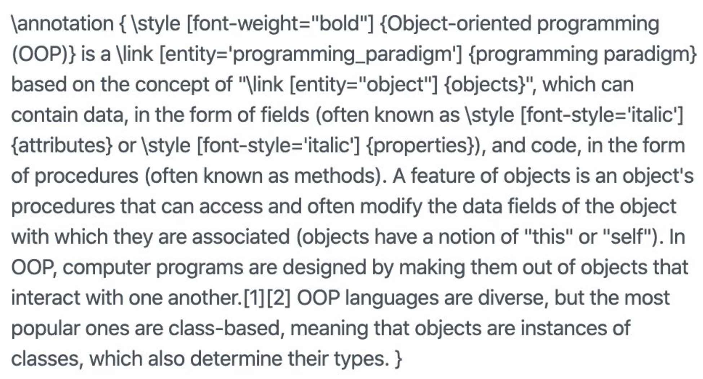
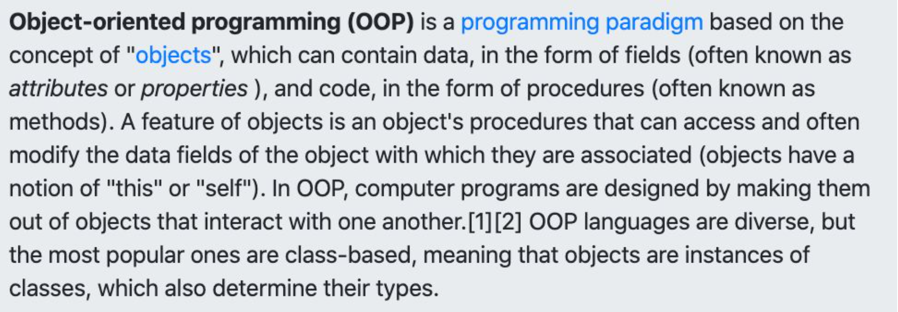
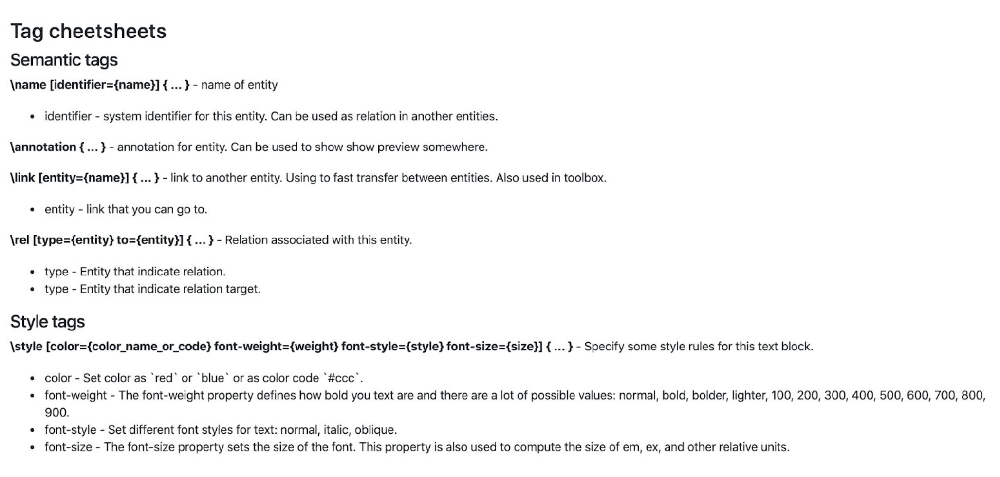
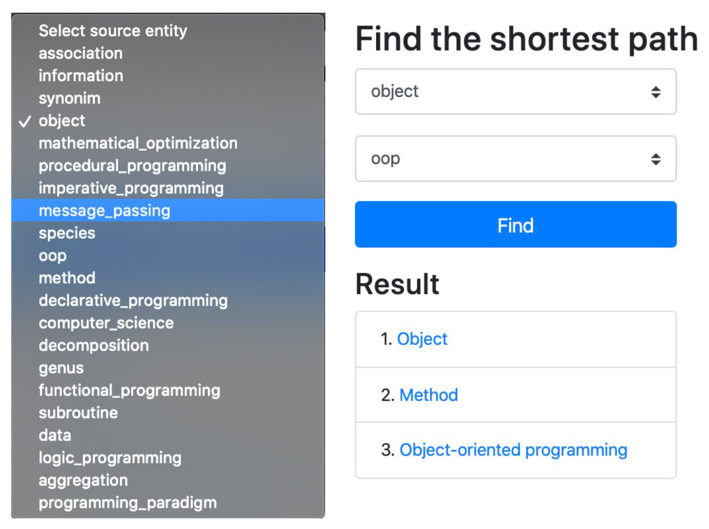
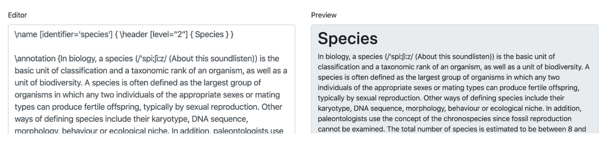

# Hypertext Editor

### Task

Implement your own hypertext model based on the principles of the formalized hypertext model.
As part of this work, you need to describe the markup language and implement a tool for viewing this markup in the form of formatted text. Tags of other common markup languages, such as HTML, XML-like MediaWiki markup languages, and markup used in forums, are not allowed. Then, based on the built model, implement one of the graph-theoretic algorithms (the implementation should allow you to calculate the shortest paths between 2 pages).
Develop and implement a documentary hypertext information search system based on documents implemented in the previous hypertext laboratory model

Description of the implemented hypertext model
In the implemented hypertext model (HT), an information reference article (IRA) corresponds to an information object whose content is characterized by semantic unity and logical integrity. Within the framework of implementation, it appears as an "entity". Each IRA element can be assigned labels that are unique within the IRA. The placemark name serves as the formal ID of the IRA and is used for addressing it programmatically. Within the GT, all IRA must have unique (i.e. non-matching) names. The title represents the meaningful name of the IRA. Any text block in the system can be marked with a hyperlink, using the special \link tag, which is described in the next section. When you click on a hyperlink (for example, by clicking on it with the mouse), you will be redirected to another article.

Figure 1. Example of an article describing the entity “Object-oriented programming”

The formalized model of the implemented IRA contains:
 - The IRA name (indicated using the \name - identifier tag parameter).
 - The IRA header (indicated by the \name tag, the header text is specified in the tag block. Description of tags in the section below).
 - IRA annotation (denoted by the \annotation tag. The abstract helps to display more General information about the article, which can be used in other parts of the system to “quickly view” information about the article, without having to open it).
 - A set of text fragments included in the IRA (in this implementation, they are not marked in any way, all information that is not marked with any tags is considered a text fragment).
 - List of hyperlinks between IRA.

In all IRA, only the IRA name and ID are required; the other elements are optional. The name serves as the formal ID of the IRA and is used for addressing it programmatically. Within the GT, all IRA must have unique (i.e. non-matching) names. The title represents the meaningful name of the IRA.

### Description of the hypertext markup language.

In this implementation, there are two types of tags (tags will be called markup language elements that combine certain rules for a group of text elements) that you can use: semantic and stylistic. Semantic tags are used to identify articles, mark parts of the system (the \annotation tag), and indicate the relationship of one article to another. Semantic tags do not affect the display of information in any way. Stylistic tags are responsible for the” appearance " of information: text color, font, and style. Tags can be nested in each other, i.e. a stylistic tag can be part of a semantic tag and Vice versa.

Figure 2. Example of a tag indicating the title of an article and a nested header tag.

#### The format of the tag

The tag consists of three blocks:
1. Title tag. The name must start with the ‘ \ ' sign (backslash). Currently, the following tags are available: \name, \annotation, \link, \rel, \style.
2. Parameter block. It must be enclosed in square brackets. The parameters inside are separated by a space, and the parameter values should be placed in brackets (single or double).
3. Block of the tag body. Must be wrapped in curly brackets. It can contain both text and other tags.

Figure 3. A tag indicating a hyperlink. \link-name of the tag. entity-tag parameter, programming_paradigm-parameter value. “programming paradigm” - the body of the tag.

Figure 4. An annotation tag that includes other tags.

Figure 5. Display as formatted text.

Figure 6-help for all tags and their parameters that can be used in the system.

### Realization of a graph-theoretic algorithm

The system also allows you to find the shortest path from one selected article to another. For this task it was used the algorithm of breadth-first search.

#### Algorithm of breadth-first search:
1. Place the node that the search starts from in the initially empty queue.
2. Extract node u from the beginning of the queue and mark it as expanded.
    - If node u is the target node, then complete the search with the result "success".
    - Otherwise, all node successors that are not yet deployed and are not in the queue are added to the end of the queue.
3. If the queue is empty, then all nodes of the connected graph have been scanned, hence the target node is unreachable from the initial one; end the search with the result "failed".
4. Go back to item 2.

In this implementation, all nodes of the graph (articles) were not loaded into memory due to possible system overgrowth. Articles for each new “wave” of the algorithm were loaded dynamically, which will allow you not to load RAM in vain.

### A description of the implementation
The system allows you to select a starting and ending article from the list of existing articles and perform a search.

Figure 7. Implementation of the shortest path search between two selected articles.

### Implementation of a hypertext information search engine

#### Presenting information for the search engine

For this IPS, information must be presented in the form of concepts and relationships. The concepts are the articles themselves with identifiers. For relations between concepts, the \rel tag was introduced, which indicates that there is a relationship between the article that contains the tag and the article specified in the parameter of this tag. The “relationship "entity itself must also be present in the system as an" entity”, otherwise the system will not allow such a relationship to be created. With this representation of information, you can make relationships between articles of any kind, and the relationships themselves will also be described in the system and they can be viewed and edited if necessary.

For example, the article “Imperative programming” is a type of "programming Paradigm". In this case the relationship will look like this:

Figure 8-species Relation for the article " programming Paradigm”

The article " species” is also present in the system:

Figure 9 - Article Species

#### Search query format

The search query is set in the form of several relationships that can be combined using logical functions: AND ( & ), OR ( | ), XOR (^).

The format of a single relationship looks like this: (?) => [species] = > (oop). Here in the first place is the sign ‘?’ , which denotes the desired entity, on the second - the relation, on the third-the known entity. The symbols '= > ' and ' < = 'are used only for illustrative purposes. Relationships can also be written in reverse order, i.e.: (oop) <= [species] < = (?).

You can also use multiple conditions: in this case, only entities that fulfill both conditions will be found, or one of them (depending on the logical function between the conditions). Example: (oop) < = [species] < = (?) & (?) => [genus] => (programming_paradigm)

You can read this relationship like this: Find a relationship that has a subspecies of "oop “and is a type of”programming_paradigm".

#### An example implementation

The result of the query from the example above is the only result of "Imperative programming".

Figure 10. The result of a search query
